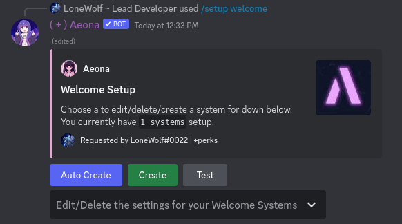

# 🙏 Welcome

### Steps

#### 1. Setting the channel.

Run `/setup welcome` to open the menu.

Then click on `Create` to set the channel or click on `Auto Create` to have Aeona create a channel automatically.

<figure><figcaption></figcaption></figure>


If you are setting the channel make sure it is a text channel.


<figure><figcaption></figcaption></figure>

## Adding Welcome Role/Editing the welcome message

Run `/setup welcome` to open the menu and make sure you have atleast 1 system.

then use the drop down to select a config.

<figure><figcaption></figcaption></figure>

Then you should get a screen like this.

<figure><figcaption></figcaption></figure>

you can now edit/delete the settings for that system.

